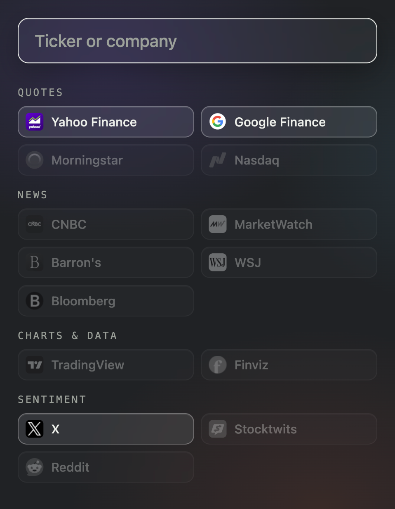

# Stocks Launcher

A Chrome extension: type a ticker or a company name, hit Enter, and every
research site you care about opens at once — each on the **direct quote
page** for that symbol, bundled in one named tab group.



- **`sl tsla` from the address bar** — the omnibox keyword works from any
  page, suggestions included, no clicking
- **One tab group per lookup** — a "TSLA" bundle in your tab strip you can
  collapse or close as one
- Fourteen sites, grouped by purpose: **Yahoo Finance**, **Google
  Finance**, **Morningstar**, **Nasdaq** · **CNBC**, **MarketWatch**,
  **Barron's**, **WSJ**, **Bloomberg** · **TradingView**, **Finviz** ·
  **X**, **Stocktwits** and **Reddit** (cashtag searches)
- Suggestions as you type, by ticker or company name — from a bundled
  dataset, so they're instant and work offline
- Check or uncheck any site — Yahoo Finance, Google Finance and X start
  on, the rest are yours to enable; picks sync across your Chromes
- No server, no account, no API keys, no tracking

## Install

Not on the Chrome Web Store yet — load it straight from the repo:

```
npm install
npm run build:ext
```

Then in Chrome: `chrome://extensions` → turn on **Developer mode**
(top right) → **Load unpacked** → pick the `dist-extension/` folder.

## Try it without installing

The same launcher runs as a web page at
**[taufiqxr.github.io/stocks-launcher](https://taufiqxr.github.io/stocks-launcher/)** —
identical box, suggestions and site picker; tabs open plainly rather than
grouped (tab groups are an extension power).

## Why

Looking up one stock across five sites is five address bars and five
searches. This is one box.

## How it works

Suggestions come from a dataset built at deploy time from the SEC's public
ticker files (`scripts/build-symbols.mjs`) — ~39,000 US-listed companies and
funds with their exchange, which is what lets Morningstar, Barron's and WSJ
open on direct quote pages instead of search results. Anything the dataset
doesn't know (foreign listings, crypto) still opens: unknown symbols take
each site's search page instead. See [PLAN.md](PLAN.md) for the architecture
and the verified URL-pattern table.

## Develop

```
npm install
npm run dev          # the web page, hot-reloaded
npm run build:ext    # the extension, into dist-extension/
```

`npm run build` / `build:ext` run the SEC symbol pipeline automatically;
pushes to `main` deploy the web page via GitHub Actions.

## License

[MIT](LICENSE)
